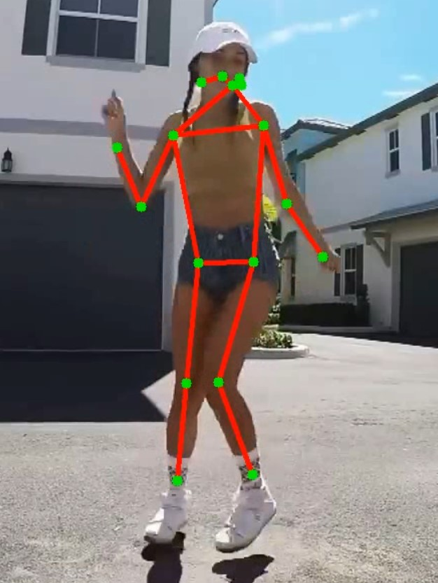

# pose-estimation
Demo of movenet pose estimation. Can be used to create videos with overlayed pose estimations for up to six people.

[Singlepose Example](https://youtu.be/N1KlFnjoEtg), [Multipose Example](https://youtu.be/XxJNebC_oqc)

## Usage

Run ``movenet.py`` with ``--path`` set to the input video path. The output will be saved to ``data/output``.

Example:

```
python movenet.py --path ../data/input/pose_estimation_video.mp4
```

## Docker Environment
Building image:
```
docker-compose build
```

Starting container/environment:
```
docker-compose up -d
```

Opening a shell in container:
```
docker-compose exec app bash
```

Instead of opening a shell, you can also go to http://localhost:8888/ to access a Jupyter Lab instance running inside the container.

Stopping container/environment:
```
docker-compose down
```

## Example Output
</img>
